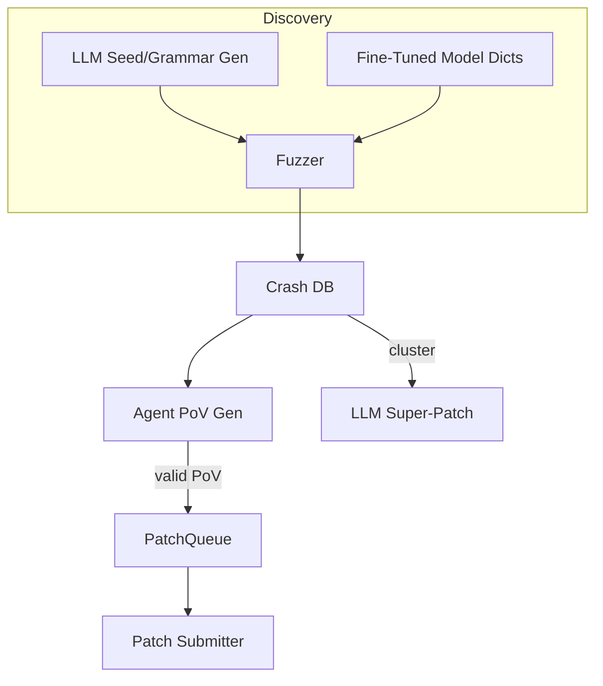

# AI-Assisted Fuzzing & Vulnerability Discovery

This skill helps you leverage large language models to supercharge traditional vulnerability research pipelines. It covers seed generation, grammar evolution, crash analysis, exploit generation, and AI-guided patching.

## When to Use This Skill

Use this skill when you need to:
- Generate semantically valid fuzzing seeds for complex input formats (SQL, URLs, binary protocols)
- Evolve fuzzing grammars based on coverage feedback
- Analyze crashes and generate proof-of-vulnerability (PoV) exploits
- Create mutation dictionaries for directed fuzzing
- Cluster crash signatures and generate unified patches
- Set up an end-to-end AI-assisted vulnerability discovery workflow

## Core Techniques

### 1. LLM-Generated Seed Inputs

Traditional fuzzers mutate bytes blindly. LLMs can generate **syntax-correct, security-relevant inputs** that reach deeper code paths faster.

**Use the seed generator script:**

```bash
python scripts/gen_seeds.py --format <format> --count <N> --output <file>
```

**Supported formats:**
- `sql` - SQL injection payloads
- `xss` - Cross-site scripting payloads
- `path` - Path traversal payloads
- `url` - URL manipulation payloads
- `custom` - Custom format (provide prompt)

**Example:**
```bash
python scripts/gen_seeds.py --format sql --count 200 --output seeds.txt
afl-fuzz -i seeds.txt -o findings/ -- ./target @@
```

**Tips:**
- Ask for diverse payload lengths and encodings (UTF-8, URL-encoded, UTF-16-LE)
- Keep payloads under common length limits (≤256 bytes)
- Regenerate with modified prompts to target specific vulnerabilities

### 2. Grammar-Evolution Fuzzing

Let the LLM **evolve a grammar** based on coverage feedback instead of just generating seeds.

**Workflow:**
1. Generate initial grammar via prompt
2. Fuzz for N minutes, collect coverage metrics
3. Feed uncovered areas back to LLM for grammar refinement
4. Repeat until coverage plateaus

**Use the grammar evolution script:**

```bash
python scripts/evolve_grammar.py \
  --grammar grammar.txt \
  --coverage-report coverage.json \
  --output grammar_v2.txt
```

**Key parameters:**
- `--max-epochs` - Number of refinement iterations (default: 5)
- `--coverage-threshold` - Stop when Δcoverage < threshold (default: 0.01)
- `--diff-mode` - Use diff/patch instructions for efficient edits

**Example prompt for grammar refinement:**
```
The previous grammar triggered 12% of program edges.
Functions not reached: parse_auth, handle_upload.
Add or modify rules to cover these areas.
```

### 3. Agent-Based PoV Generation

After finding a crash, you need a **deterministic proof-of-vulnerability**.

**Use the crash analyzer script:**

```bash
python scripts/analyze_crashes.py \
  --crash-db crashes/ \
  --target ./binary \
  --output povs/
```

**What it does:**
1. Reads crash signatures (PC, input slice, sanitizer messages)
2. Attempts to reproduce locally with gdb
3. Generates minimal exploit payloads
4. Validates in sandbox
5. Saves working PoVs, re-queues failures as fuzzing seeds

**Output structure:**
```
povs/
├── crash_001/
│   ├── input.bin          # Minimal triggering input
│   ├── gdb-session.txt    # Reproduction steps
│   └── analysis.md        # Vulnerability explanation
└── failed_seeds.txt       # Re-queued for fuzzing
```

### 4. Directed Fuzzing with Mutation Dictionaries

Fine-tuned code models can suggest **targeted mutation patterns** for specific functions.

**Generate mutation dictionaries:**

```bash
python scripts/gen_seeds.py \
  --format custom \
  --prompt "Give mutation dictionary entries likely to break memory safety in sprintf wrapper" \
  --output mutations.txt
```

**Example output:**
```
{"pattern": "%99999999s"}
{"pattern": "AAAAAAAA....<1024>....%n"}
```

**Integrate with AFL++:**
```bash
afl-fuzz -i seeds.txt -o findings/ \
  -x mutations.txt \
  -- ./target @@
```

### 5. AI-Guided Patching

#### Super Patches
Cluster crash signatures and generate **unified patches** that fix multiple bugs from a common root cause.

```bash
python scripts/analyze_crashes.py \
  --crash-db crashes/ \
  --mode super-patch \
  --output patches/
```

**Prompt template:**
```
Here are N stack traces + file snippets.
Identify the shared mistake and generate a unified diff fixing all occurrences.
```

#### Speculative Patch Queue
Interleave confirmed PoV-validated patches with speculative patches at a tunable ratio.

**Configuration:**
```json
{
  "confirmed_ratio": 1,
  "speculative_ratio": 2,
  "penalty_threshold": 0.3
}
```

## End-to-End Workflow



**Recommended sequence:**
1. Generate seeds with `gen_seeds.py`
2. Run fuzzer (AFL++, libFuzzer, Honggfuzz)
3. Collect crashes in database
4. Run `analyze_crashes.py` for PoV generation
5. Generate patches with super-patch mode
6. Submit patches, monitor scoring
7. Feed failed PoVs back as fuzzing seeds

## Best Practices

### Seed Generation
- **Diversify encodings:** Ask for UTF-8, URL-encoded, UTF-16-LE variants
- **Respect limits:** Keep payloads under common length thresholds
- **Single script:** Request self-contained Python scripts to avoid JSON parsing issues

### Grammar Evolution
- **Budget tokens:** Each refinement costs tokens; set reasonable limits
- **Use diffs:** Prefer patch instructions over full rewrites
- **Stop early:** Halt when coverage improvement plateaus (Δ < 0.01)

### Crash Analysis
- **Parallelize:** Spawn multiple agents with different models/temperatures
- **Validate:** Always test PoVs in sandbox before submission
- **Feedback loop:** Failed attempts become new fuzzing seeds

### Patching
- **Cluster first:** Group crashes by signature before patching
- **Cost model:** Track penalties vs. points to tune speculative ratio
- **Unified diffs:** Prefer single patches fixing multiple bugs

## Integration with Existing Tools

### AFL++
```bash
# Generate seeds
python scripts/gen_seeds.py --format sql --output seeds/

# Run with mutation dictionary
afl-fuzz -i seeds/ -o findings/ -x mutations.txt -- ./target @@
```

### libFuzzer
```bash
# Generate grammar
python scripts/evolve_grammar.py --grammar grammar.txt

# Compile with grammar
clang -fsanitize=fuzzer -o fuzzer fuzzer.cpp
./fuzzer grammar.txt
```

### Honggfuzz
```bash
# Generate seeds
python scripts/gen_seeds.py --format custom --prompt "..." --output seeds/

# Run
hfuzz_run -i seeds/ -o findings/ -- ./target @@
```

## Troubleshooting

**Seeds not triggering new coverage:**
- Increase payload diversity (ask for more encodings)
- Try grammar evolution instead of static seeds
- Check if target has input validation blocking malformed inputs

**Grammar not improving:**
- Verify coverage metrics are accurate
- Increase refinement epochs
- Try different LLM or temperature settings

**PoV generation failing:**
- Check crash reproducibility manually first
- Increase agent count for parallel attempts
- Lower temperature for more deterministic outputs

**Patches being rejected:**
- Validate PoVs before patching
- Reduce speculative patch ratio
- Review crash clustering for false positives

## References

- [Trail of Bits – AIxCC finals: Tale of the tape](https://blog.trailofbits.com/2025/08/07/aixcc-finals-tale-of-the-tape/)
- [CTF Radiooo AIxCC finalist interviews](https://www.youtube.com/@ctfradiooo)
- [AFL++ Documentation](https://aflplus.plus/)
- [libFuzzer Documentation](https://llvm.org/docs/LibFuzzer.html)
